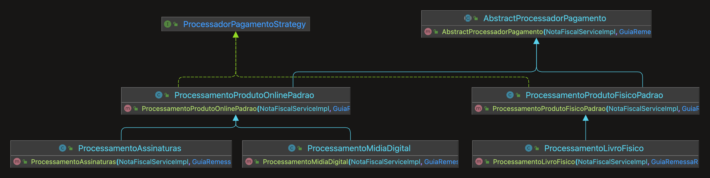
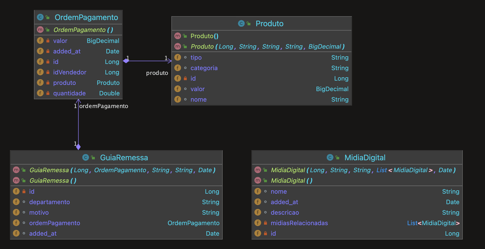

# Processador Pagamentos
- Aplicaçao Spring boot responsável por processar os pagamentos, com a lógica respectiva para cada tipo de produto ou categoria.
1 Endpoint exposto para receber a ordem de pagamento
- Repositório GitHub: https://github.com/lucashnoliveira/payment-processor.git

# Especificações Técnicas
- Java 17
- Spring boot
- Gradle 8.5
- Docker Compose

# Rodando o Projeto
- Para rodar o projeto é necessário antes rodar o docker-compse com o seguinte comando para 
- inicialização do banco Postgres
```shell
docker-compose up
```
- Após inicializar o container basta iniciar a aplicação através do intelliJ ou outro editor ou ainda 
mesmo através do terminal via os seguintes comandos
- Buildar o projeto, o que gerará o .jar
```shell
./gradlew build
```
- Após isso só executar com o seguinte comando
```shell
java -jar build/libs/processor-1.0.0-SNAPSHOT.jar
```

# Rodando testes
- Parar rodar os testes basta rodar o seguinte comando
```shell
./gradlew test
```

# Realizando chamadas
- Enpoint: localhost:8080/pagamentos/processarPagamento
- Exemplo body Json: 
`{
  "id": 1,
  "idVendedor": 1,
  "quantidade": 1,
  "valor": 10,
  "produto" : {
  "id": 1,
  "nome": "Livro Teste",
  "tipo": "Livraria",
  "categoria": "Fisico",
  "valor": 10
  }
  }`


# Explicando a Solução
- Criei uma aplicação Spring boot, devido a facilidade da implementação, mas acredito que um modelo orientado a eventos
onde uma api pura, sem nenhum tipo de processamento, somente validações, receba as requisições e encaminha para outro ou
outros serviços responsáveis por fazer esse processamento, através de uma fila ou broker.
- Para o problema das regras mutáveis e crescentes eu adotei um padrão de projeto strategy, onde de acordo com o tipo
e categoria do item, a classe `ProcessadorPagamentoFactory` tenta encontrar um processador específico para aquela combinação
de tipo e categoria, caso não encontre, utilizará um processor padrão para o tipo de produto.
- Os comportamentos comuns a todos os produtos foram incorporados em uma classe abstrata, de qual todos os processadores
herdam, tais comportamento como emitir nota fiscal, gerar guia de remessa dentre outros estão nessa classe.


# Diagrama de classes core processadores - Strategy Pattern
- Abaixo anexo o diagrama de classe resumido, somente com a parte principal do problema a ser revolvido
que utiliza o padrão de projeto strategy para escolher qual service será utilizado para processar cada
ordem de pagamento.
- A classe `AbstractProcessadorPagamento` é responsável por agrupar comportamentos comuns a todos os processadores.



# Diagrama Relacionamento Classe Entidades/Dominio

